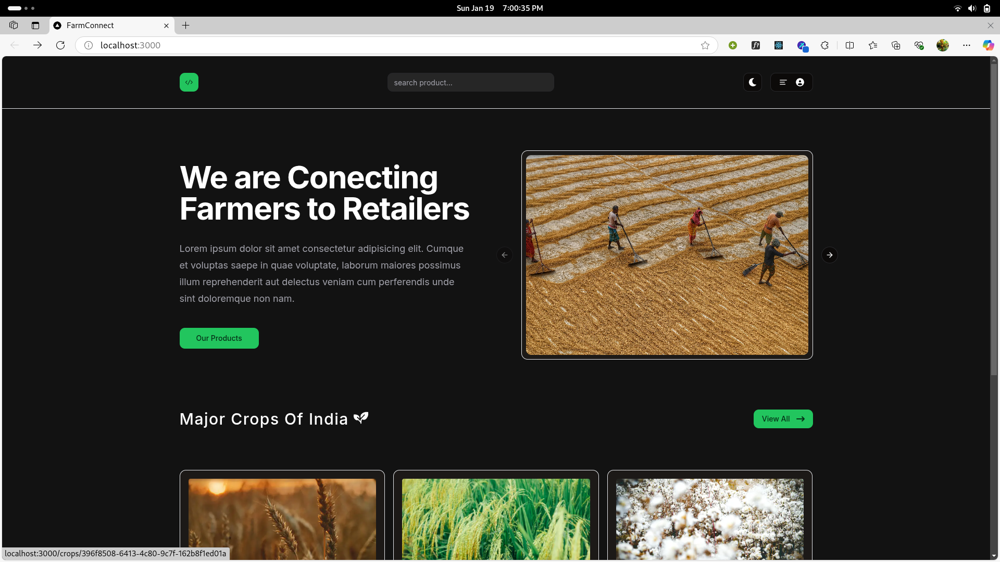
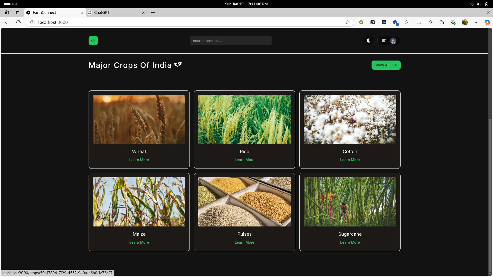
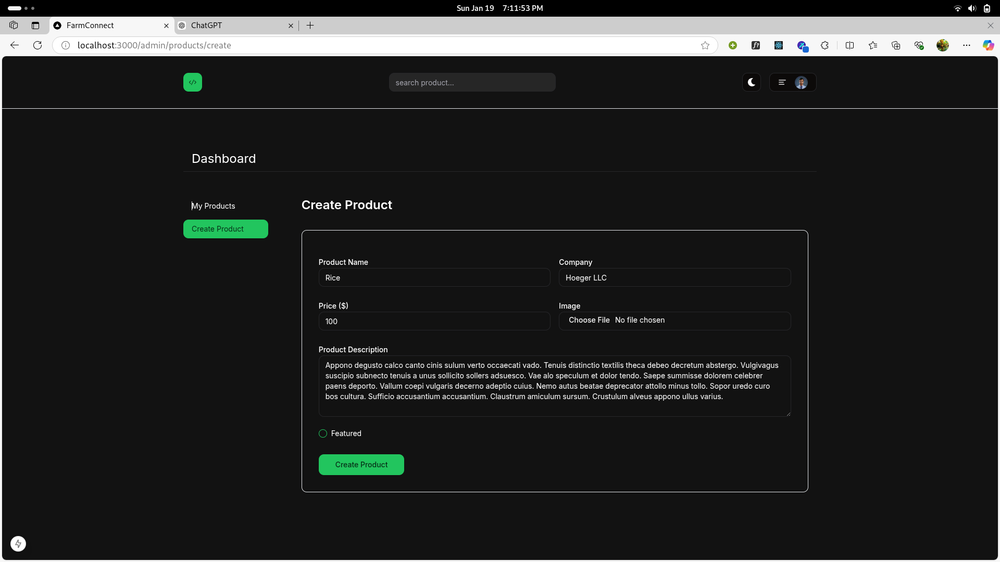
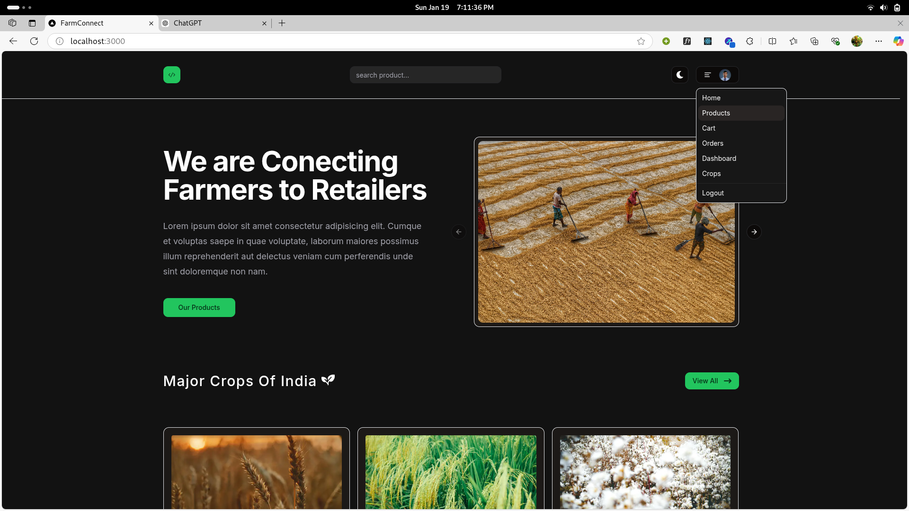
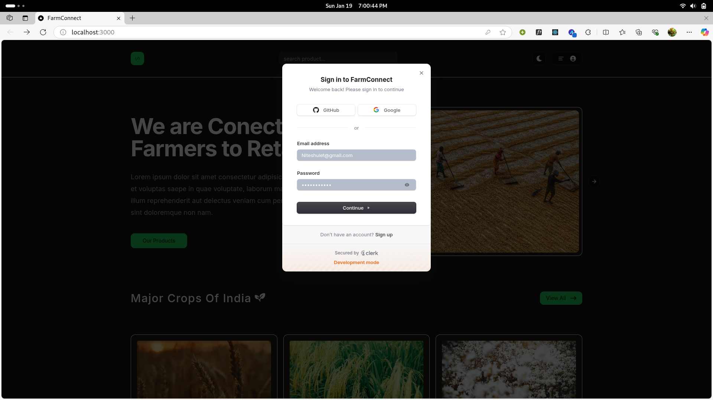
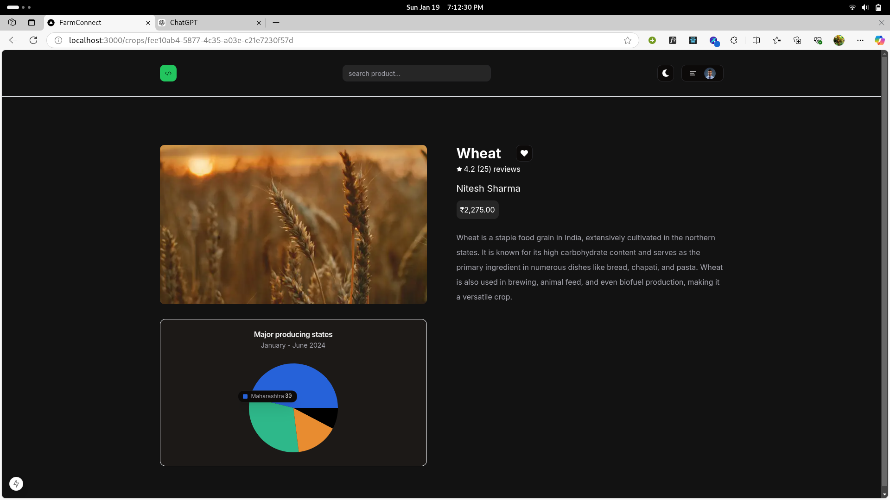

# FarmConnect

## Description 
FarmConnect is a platform designed to connect farmers with consumers, providing a marketplace for fresh, locally-sourced produce. Our mission is to support sustainable agriculture and promote healthy eating by making it easier for people to access farm-fresh products.

(User and Producer communication is enabled using WebRTC/WebSockets.)

---

## Table of Contents
## Features
## Technologies Used
## Installation
## Future Work

---

## Features

### 1. Improved UI with Suspense and Skeleton Components
- **Description**: Utilizes React Suspense and Skeleton components to load user data progressively.
- **Purpose**: Enhances UI availability and ensures a smooth user experience even when data is being fetched.

### 2. Route Protection with Clerk Validations
- **Description**: Implements user authentication and authorization using Clerk to validate routes.
- **Purpose**: Ensures secure access to resources, preventing unauthorized users from viewing or modifying content.

### 3. Dynamic Routing for Product Details
- **Description**: Leverages dynamic routing to display detailed information for each product.
- **Purpose**: Provides users with a seamless navigation experience while exploring individual products.

### 4. Admin Dashboard
- **Description**: A feature-rich dashboard for administrators to manage products effectively.
- **Functionalities**:
  - Create new products.
  - Delete existing products.
  - Manage product inventory and details.

---

## Technologies Used

 **React and Next.js**: Provides server-side rendering and dynamic routing for optimal performance.
- **Clerk**: For user authentication and management, ensuring secure login and profile features.
- **Supabase**: Real-time database management using PostgreSQL, ensuring data scalability and integrity.
- **PostgreSQL**: Robust database system for handling complex queries and transactions.
- **Tailwind CSS**: Utility-first CSS framework for building custom, responsive interfaces efficiently.
- **Zod**: Schema validation for ensuring data integrity across the application.
-**Typescript**: Type checking and static analysis for improved code quality and security.
-**Stripe**: Payment processing for secure transactions and subscriptions.


## Screenshots

### Home Page


### Crops Page


### Dashboard for the farmers




### authorization using Clerk




### Single crop data


### Storing data on cloud using Supabase Container


---

## Installation

To get started with the project, follow these steps:

1. Clone the repository:
   ```bash
   git clone https://github.com/nitesh-20-2003/Ecommerce-Dashboard.git
   ```
2. Navigate to the project directory:
   ```bash
   cd Ecommerce-Dashboard
   ```
3. Install dependencies:
   ```bash
   npm install
   ```
4. Start the development server:
    ```bash
    npm start
    ```
## Technologies Used
- **Next.js**: We chose Next.js for its powerful features like server-side rendering and static site generation, which improve performance and SEO for our web application.
-**Typescript**:To provide type security to the project instead of javascript to scale the project to higher level.
- **Clerk**: Clerk is used for user authentication and management, providing a seamless and secure way for users to sign up, log in, and manage their profiles.
- **shadcn/ui**: This library offers a collection of accessible and customizable UI components, helping us build a consistent and visually appealing user interface.
- **Supabase**: Supabase is an open-source alternative to Firebase, offering real-time database capabilities and authentication using PostgreSQL, which ensures data integrity and scalability.
- **PostgreSQL**: We use PostgreSQL as our database system due to its robustness, scalability, and support for complex queries and transactions.
- **Tailwind CSS**: Tailwind CSS allows us to rapidly build custom user interfaces with its utility-first approach, making the styling process more efficient and maintainable.
- **Zod**: Zod is used for schema declaration and validation, ensuring that our data is correctly structured and validated throughout the application.


## Workflow
### User Authentication and Authorization
- Users must sign up or log in using Clerk to access the application.
Clerk ensures secure user management with features like passwordless authentication and multi-factor authentication (MFA).
Only authenticated users can access restricted pages, providing a secure and personalized experience.
### Admin Access
The admin user has exclusive access to the dashboard.
Admins can create and manage various entities, such as farms, crops, or other relevant data.
Admins can add, update, and delete data in the system.
### Data Presentation
All data is dynamically fetched from Supabase (powered by PostgreSQL) and displayed across various pages of the application.
Pages are designed to present data in an organized way, including detailed statistics, charts, and metrics for actionable insights.
### Real-Time Updates
Supabase's real-time capabilities ensure that changes to the data are instantly reflected across the application.
Users always see the most up-to-date information without needing to refresh the page manually.
### UI/UX Design
The application interface is built using shadcn/ui and Tailwind CSS, providing a consistent and visually appealing user experience.
The design is fully responsive, ensuring seamless functionality across all devices.
### Form Validation and Type Safety
Forms and inputs are validated using Zod to ensure data correctness and prevent invalid submissions.
TypeScript is used throughout the project, providing type safety, reducing runtime errors, and making the application scalable for future development.


## Future Work

### 1. One-to-Many Relationship for Ratings
- **Objective**: Enable each product to have multiple unique ratings.
- **Benefits**:
  - Allows users to rate products individually.
  - Aggregates product ratings to provide a comprehensive overview.

### 2. Cart Orders for Each Product
- **Objective**: Establish a feature where each product can be added to multiple orders.
- **Benefits**:
  - Facilitates seamless cart and checkout functionalities.
  - Tracks order history for better user insights.

### 3. AI-based Chatbot Integration
- **Objective**: Integrate an AI-powered chatbot using Dialogflow and Flask.
- **Benefits**:
  - Enhances user interaction with instant query resolution.
  - Guides users in navigating the platform and understanding features.

### 4. Real-time Communication Between Users and Producers
- **Objective**: Introduce a feature using WebRTC and WebSockets to enable direct communication between users and producers.
- **Use Cases**:
  - **Collaboration**: Facilitates partnerships and discussions for future deals.
  - **Personalized Assistance**: Users can directly discuss product details, bulk orders, or customizations with producers.

---

## ER Diagram (Proposed Relationships)

### Entities and Relationships
1. **Product**:
   - Has a one-to-many relationship with **Rating**.
   - Can be associated with multiple **Orders**.

2. **Rating**:
   - Each product can have multiple unique ratings.

3. **Order**:
   - Contains multiple products, enabling users to create customized carts.

4. **User and Producer Communication**:
   - Enabled via WebRTC and WebSockets for real-time interaction.
