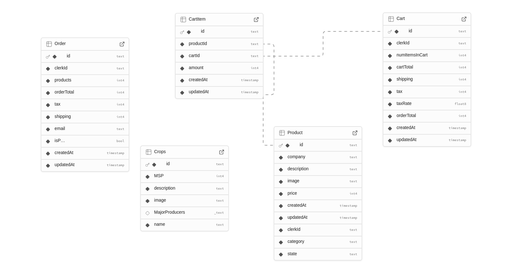
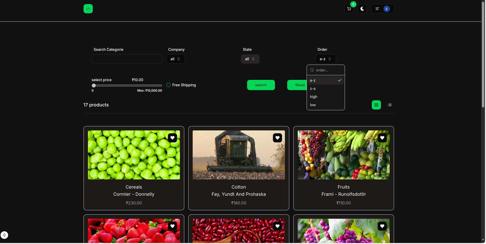
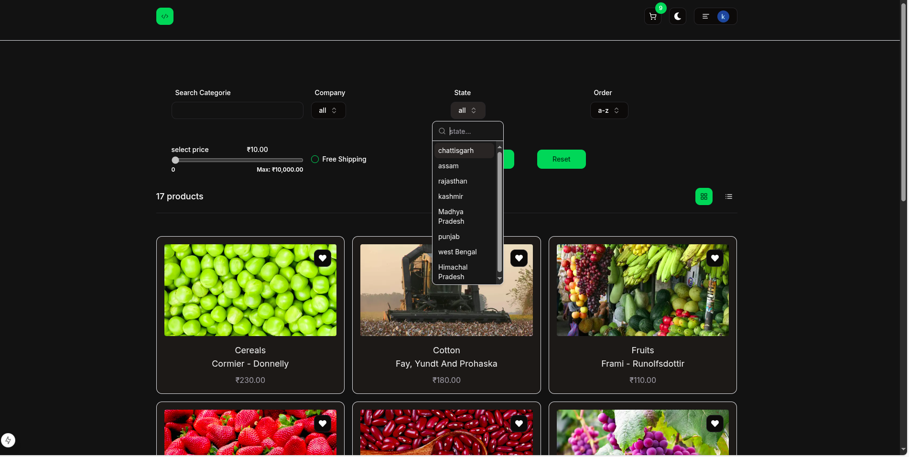
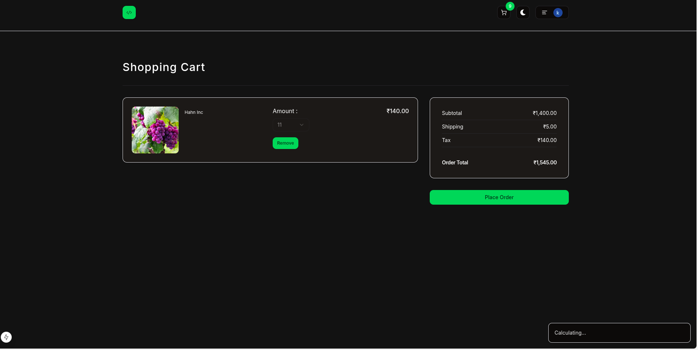
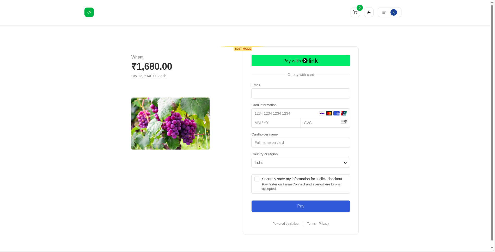
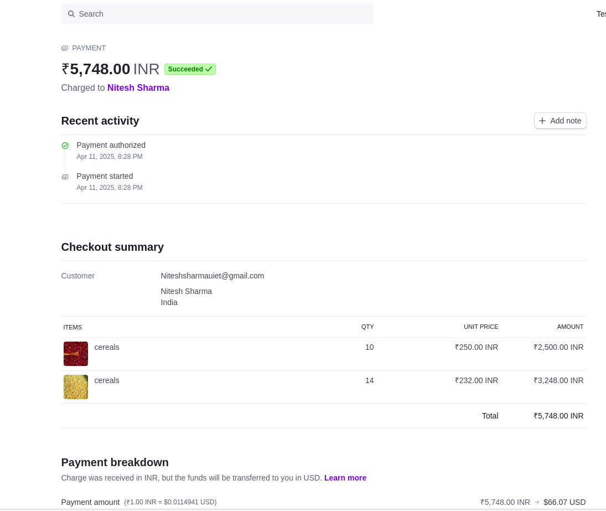
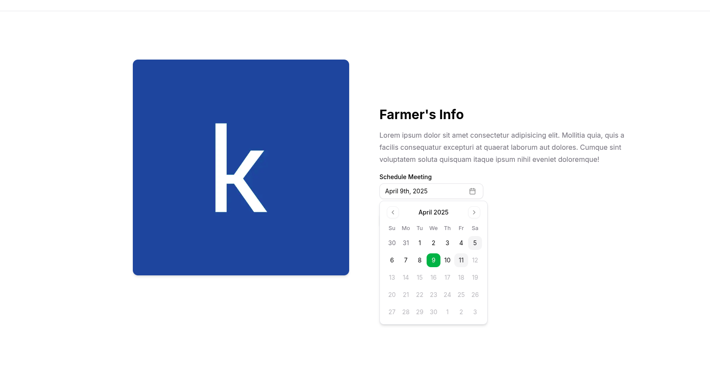

# FarmConnect

## Description 
FarmConnect is a platform designed to connect farmers with consumers, providing a marketplace for fresh, locally-sourced produce. Our mission is to support sustainable agriculture and promote healthy eating by making it easier for people to access farm-fresh products.

(User and Producer communication is enabled using WebRTC/WebSockets.)

---

## Table of Contents
- [Technologies Used](#technologies-used)
- [Features](#features)
- [Installation](#installation)
- [Future Work](#future-work)


---

## Technologies Used

 **React and Next.js**: Provides server-side rendering and dynamic routing for optimal performance.
- **Clerk**: For user authentication and management, ensuring secure login and profile features.
- **Supabase**: Real-time database management using PostgreSQL, ensuring data scalability and integrity.
- **PostgreSQL**: Robust database system for handling complex queries and transactions.
- **Tailwind CSS**: Utility-first CSS framework for building custom, responsive interfaces efficiently.
- **Zod**: Schema validation for ensuring data integrity across the application.
-**Typescript**: Type checking and static analysis for improved code quality and security.
-**Stripe**: Payment processing for secure transactions and subscriptions.
## Features

### 1. Improved UI with Suspense and Skeleton Components
- **Description**: Utilizes React Suspense and Skeleton components to load user data progressively.
- **Purpose**: Enhances UI availability and ensures a smooth user experience even when data is being fetched.

### 2. Route Protection with Clerk Validations
- **Description**: Implements user authentication and authorization using Clerk to validate routes.
- **Purpose**: Ensures secure access to resources, preventing unauthorized users from viewing or modifying content.

### 3. Dynamic Routing for Product Details
- **Description**: Leverages dynamic routing to display detailed information for each product.
- **Purpose**: Provides users with a seamless navigation experience while exploring individual products.

### 4. Admin Dashboard
- **Description**: A feature-rich dashboard for administrators to manage products effectively.
- **Functionalities**:
  - Create new products.
  - Delete existing products.
  - Manage product inventory and details.

### 5. Payment Processing
- **Description**: Enables secure payment processing using Stripe.
- **Functionalities**:
  - Accept payments for products.
  - Handle subscriptions and billing.
 ### 6. Advanced Filters and  Pagination
- **Description**: Implements advanced filters and pagination for product exploration.
- **Functionalities**:
  - Filter products based on various criteria.
  - Navigate through multiple pages of products. 
---


## Screenshots
### Schema Design


### Home Page


### Crops Page


### Dashboard for the farmers


### authorization using Clerk


### Single crop data


### Storing data on cloud using Supabase Container


---
###  Advanced Filters And Pagination





### Cart 



### Stripe Payment

 ### direct payment from front end to stripe is not so secure so i am going to use an routing intead
 ### instead of direct sending request ill send it first to my route defined than it to the stripe API

 ```plaintext
+--------+    Fetch clientSecret    +--------+   Request        +---------+
| Client | -----------------------> | Server | ---------------> | Stripe  |
|        |                          |        |                  |  API    |
|        |                          |        | <--------------- |         |
|        | <----------------------- |        |   clientSecret   |         |
|        |  clientSecret response   |        |                  |         |
+--------+                          +--------+                  +---------+

Checkout.tsx                        payment/route.ts

```


```plaintext
+--------+    Checkout Session ID   +--------+    redirect      +---------+
| Server | -----------------------> | Server | ---------------> | Orders  |
|        |                          |        |                  |         |
|        |                          |        |                  |         |
|        |                          |        |                  |         |
|        |                          |        |                  |         |
+--------+                          +--------+                  +---------+

payment/route.ts                    confirm/route.ts            orders page

```




## Workflow
### User Authentication and Authorization
- Users must sign up or log in using Clerk to access the application.
Clerk ensures secure user management with features like passwordless authentication and multi-factor authentication (MFA).
Only authenticated users can access restricted pages, providing a secure and personalized experience.
### Admin Access
The admin user has exclusive access to the dashboard.
Admins can create and manage various entities, such as farms, crops, or other relevant data.
Admins can add, update, and delete data in the system.
### Data Presentation
All data is dynamically fetched from Supabase (powered by PostgreSQL) and displayed across various pages of the application.
Pages are designed to present data in an organized way, including detailed statistics, charts, and metrics for actionable insights.
### Real-Time Updates
Supabase's real-time capabilities ensure that changes to the data are instantly reflected across the application.
Users always see the most up-to-date information without needing to refresh the page manually.
### UI/UX Design
The application interface is built using shadcn/ui and Tailwind CSS, providing a consistent and visually appealing user experience.
The design is fully responsive, ensuring seamless functionality across all devices.
### Form Validation and Type Safety
Forms and inputs are validated using Zod to ensure data correctness and prevent invalid submissions.
TypeScript is used throughout the project, providing type safety, reducing runtime errors, and making the application scalable for future development.


## Future Work

### 1. Real-Time Video Calling Functionality
- **Description**: 
  - Implementing real-time communication between users and farmers using WebRTC.
  - This feature will allow users to interact directly with farmers through video calls, enabling better communication and trust.
- **Purpose**:
  - To provide a seamless and interactive experience for users to discuss products, farming practices, or any other queries directly with farmers.
- **ER Diagram**:
  Below is the Entity-Relationship (ER) diagram for the video calling functionality:

  ```plaintext
  +----------------+       +----------------+       +----------------+
  |     Users      |       |   Call Logs    |       |    Farmers     |
  +----------------+       +----------------+       +----------------+
  | userId (PK)    |       | callId (PK)    |       | farmerId (PK)  |
  | name           |       | userId (FK)    |       | name           |
  | email          |       | farmerId (FK)  |       | email          |
  | ...            |       | timestamp      |       | ...            |
  +----------------+       +----------------+       +----------------+
 -**just an example how meeting sceduling works**



### 2. AI-Powered Chatbot Using NLP (Dialogflow)

-**Description**:
Developing an intelligent chatbot using Dialogflow to assist users with various tasks.
The chatbot will be capable of:
Answering user queries about products, orders, and platform features.
Assisting users in placing orders.
Providing recommendations based on user preferences.
-**Purpose**:
To enhance user experience by providing instant support and reducing the dependency on human customer service.
-**Functionalities**:
Order Placement: Users can interact with the chatbot to add items to their cart and place orders.
Query Resolution: The chatbot will answer frequently asked questions and provide guidance on using the platform.
Personalized Recommendations: Using NLP, the chatbot will analyze user preferences and suggest relevant products.
These features aim to make FarmConnect more interactive, user-friendly, and efficient, ensuring a better experience for both users and farmers.

